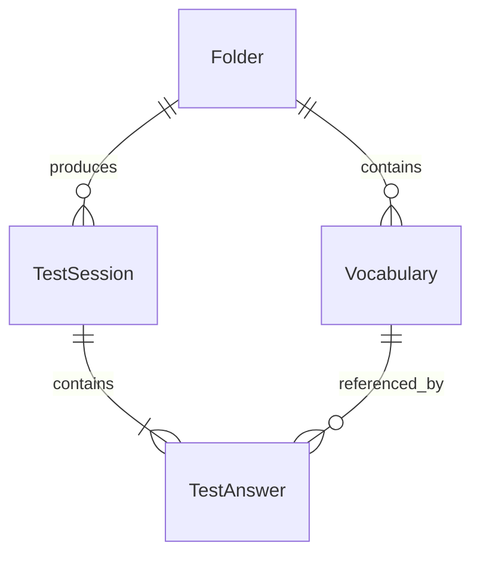

# Logical Data Model

| Field | Value |
|---|---|
| Document | Data model |
| Stage | Planning |
| Owner | Backend Lead |
| Status | ✅ PASS |
| Version | 0.1 |
| Last updated | 2026-08-26 |
| Depends on | [Specification](../01-spec/spec.md), [Database guide](database-guide.md) |
| Next review | Explicit user approval of Planning |

> **Executive summary**
>
> Four relational entities persist folders, vocabulary, completed sessions, and answer snapshots. Abandoned tests and AI text are intentionally absent. Normalized keys enforce approved case-insensitive duplicate behavior, while answer snapshots preserve historical meaning.

## Relationships

## Folder

| Field | Type | Rules |
|---|---|---|
| `id` | UUID/text | Primary key |
| `name` | text | Trimmed, 1–50 |
| `normalizedName` | text | Lowercase trimmed key; unique |
| `createdAt`, `updatedAt` | datetime | Backend-managed |

## Vocabulary

| Field | Type | Rules |
|---|---|---|
| `id` | UUID/text | Primary key |
| `folderId` | text | Required foreign key to Folder |
| `word` | text | Trimmed, 1–100 |
| `normalizedWord` | text | Lowercase trimmed key |
| `meaning` | text | Trimmed, 1–500 |
| `ipa` | nullable text | Trimmed, maximum 100; null means unavailable |
| `createdAt`, `updatedAt` | datetime | Backend-managed |

Unique composite index: `(folderId, normalizedWord)`. Index: `(folderId, createdAt)`.

## TestSession

Only completed sessions are inserted.

| Field | Type | Rules |
|---|---|---|
| `id` | UUID/text | Primary key |
| `folderId` | text | Required foreign key to Folder |
| `completionKeyHash` | text | Unique hash of signed token completion ID; prevents replay without storing the token |
| `totalQuestions` | integer | Positive |
| `correctCount` | integer | Non-negative |
| `incorrectCount` | integer | Non-negative |
| `completedAt` | datetime | Required |

Application invariant: `correctCount + incorrectCount = totalQuestions`.

Unique index: `(completionKeyHash)`. Indexes: `(folderId, completedAt)`.

## TestAnswer

| Field | Type | Rules |
|---|---|---|
| `id` | UUID/text | Primary key |
| `sessionId` | text | Required foreign key to TestSession |
| `vocabularyId` | text | Required foreign key to Vocabulary |
| `questionWord` | text | Historical snapshot |
| `selectedMeaning` | text | Submitted snapshot |
| `correctMeaning` | text | Historical snapshot |
| `isCorrect` | boolean | Backend-computed |
| `answeredAt` | datetime | Backend-managed |

Unique composite index: `(sessionId, vocabularyId)`. Indexes: `(sessionId)` and `(vocabularyId)`.

## Referential actions

- Folder deletion and vocabulary deletion are not MVP API operations; no implicit destructive cascade is exposed.
- Prisma relations use restrictive deletion for Folder/Vocabulary history and cascade from a TestSession to its answers only for test cleanup in controlled environments.
- Future deletion requirements need explicit Specification approval because they affect historical progress.

## Not persisted

- CSV upload files and invalid rows.
- Flashcard position or reveal state.
- Signed in-progress test tokens and abandoned tests.
- Generated AI text.
- Pronunciation audio.

## Transaction boundaries

- CSV valid-row insertion is one transaction after validation/classification; unique conflicts are classified safely without overwriting.
- Test completion inserts one TestSession and all TestAnswers in one transaction.
- Dashboard is read-only and uses one consistent repository operation/transaction where required.
