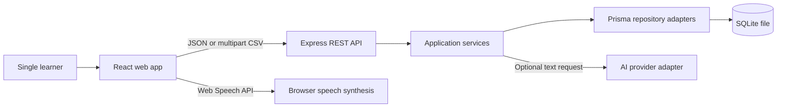

# English Learning App — Technical Plan

| Field        | Value                                                                         |
| ------------ | ----------------------------------------------------------------------------- |
| Document     | Technical plan                                                                |
| Stage        | Planning                                                                      |
| Owner        | Software Architect                                                            |
| Status       | ✅ PASS                                                                       |
| Version      | 0.1                                                                           |
| Last updated | 2026-08-26                                                                    |
| Depends on   | [Approved specification](../01-spec/spec.md), [Architecture](architecture.md) |
| Next review  | Explicit user approval of Planning                                            |

> **Executive summary**
>
> The system is planned as an npm-workspace monorepo with a React web client, Express REST API, and Prisma-managed SQLite database. Business rules live in backend application services and shared pure helpers where appropriate; the frontend never accesses persistence. The design keeps optional audio and AI failures outside core data transactions and supports separate 95% frontend/backend coverage gates.

## System context



The learner uses only the web app. The API owns validation, business decisions, persistence, dashboard calculations, test generation, and scoring. Browser speech synthesis stays client-side because no audio file is stored. AI is behind an optional backend port so its configuration cannot affect core features.

## Approved technology

| Concern     | Decision                                                         | ADR                                                                    |
| ----------- | ---------------------------------------------------------------- | ---------------------------------------------------------------------- |
| Repository  | npm workspaces with `apps/web`, `apps/api`, and focused packages | [ADR-001](architecture.md#adr-001-approved-monorepo-stack)             |
| Frontend    | React, Vite, TypeScript                                          | ADR-001                                                                |
| Backend     | Express, TypeScript, Zod                                         | ADR-001                                                                |
| Persistence | Prisma and SQLite migrations                                     | [ADR-003](architecture.md#adr-003-prisma-and-sqlite-persistence)       |
| Tests       | Vitest; React Testing Library; Supertest                         | [ADR-004](architecture.md#adr-004-testability-and-coverage-boundaries) |

## Planned folder structure

```text
english-learning-app/
├── apps/
│   ├── web/
│   │   └── src/{app,features,components,services,test}/
│   └── api/
│       ├── prisma/{schema.prisma,migrations/}
│       └── src/{app,config,http,modules,shared,test}/
├── packages/
│   └── contracts/src/
├── docs/sdd/
├── package.json
└── .env.example
```

This is a planned structure, not authorization to create it. `packages/contracts` contains transport types/schemas safe for both applications; it contains no database client or secret.

## Delivery sequence

| Phase       | Planned outcome                                                                                 | Gate dependency             |
| ----------- | ----------------------------------------------------------------------------------------------- | --------------------------- |
| Foundation  | Workspaces, strict TypeScript, formatting, separate test/coverage commands, environment parsing | Verified Tasks              |
| Persistence | Prisma schema, real migration, repositories                                                     | Approved database tasks     |
| Core API    | Folders, vocabulary, CSV, tests, dashboard, optional AI boundary                                | Approved API contract       |
| Frontend    | Accessible responsive journeys and browser audio                                                | Approved UI tasks           |
| Quality     | Unit/integration tests, review, separate coverage evidence                                      | Implementation Verification |

No implementation phase starts until Task Verification is `PASS` and explicitly approved.

## Validation and errors

- Zod validates environment variables at API startup, route parameters, JSON bodies, multipart metadata, and each parsed CSV row.
- Frontend schemas may mirror constraints for fast feedback but never replace backend validation.
- Domain/application services enforce duplicates, test eligibility, session invariants, and dashboard rules.
- All errors use the envelope in [API contract](api-contract.md#error-format); adapters translate Prisma/provider failures into safe codes.

## Feature workflows

| Feature         | Planned flow                                                                                                                                                                               |
| --------------- | ------------------------------------------------------------------------------------------------------------------------------------------------------------------------------------------ |
| CSV import      | Multipart size/type guard → parse headers → Zod row validation → normalize/deduplicate → transaction for valid rows → row report.                                                          |
| Audio/IPA       | Persist supplied IPA; display fallback if absent; invoke browser `speechSynthesis` through an injectable frontend adapter.                                                                 |
| Flashcards      | Fetch folder vocabulary, create a seeded/randomized client presentation order, reveal locally, persist nothing.                                                                            |
| Multiple choice | API validates eligibility, shuffles with injectable RNG, returns questions plus signed expiring token; completion API verifies token/answers, recomputes results, and persists atomically. |
| Dashboard       | Repository aggregate queries return folders, words, completed sessions, correct/incorrect; service computes one-decimal accuracy.                                                          |
| AI              | API validates 1–10 selected IDs, loads their words, calls an optional provider port with timeout, and returns non-persisted text.                                                          |

## Testing architecture

- Pure functions: normalization, shuffling, distractor generation, scoring, accuracy, CSV row classification.
- Frontend: components/hooks with React Testing Library; network, speech, random order, and time injected or mocked at boundaries.
- Backend: services with fake ports; HTTP integration with Supertest; repository integration against isolated temporary SQLite databases created by real migrations.
- Contract schemas are tested for representative valid, boundary, and invalid payloads.
- Frontend and backend commands emit independent text/JSON/HTML coverage reports.

### Frontend testing architecture

Vitest runs pure feature and adapter tests in a browser-like environment. React Testing Library verifies behavior through roles, labels, keyboard actions, focus, live-region feedback, loading/empty/error states, and 320-pixel layout assumptions where programmatically testable. API, speech, clock, and RNG boundaries are replaced with explicit fakes.

### Backend testing architecture

Vitest tests domain/application services through fake ports. Supertest exercises Express routes, Zod validation, error envelopes, CSV multipart behavior, signed-test completion, and optional AI failure paths. Repository integration tests apply real migrations to an isolated temporary SQLite database and verify constraints, transactions, and aggregates.

## Coverage enforcement

The frontend configures minimums of 95% statements, 95% branches, 95% functions, and 95% lines. The backend independently configures minimums of 95% statements, 95% branches, 95% functions, and 95% lines. The root verification command runs each application command separately and fails if either command or any metric fails. A combined monorepo percentage is informational only and cannot pass the gate.

### Exclusion policy

Generated Prisma client, third-party code, type-only declarations, and configuration-only files may be excluded only when the testing report records a technical justification. Feature/application files, branches, and error handlers cannot be excluded merely to raise percentages.

## Security considerations

- Backend validates every untrusted boundary and constrains CSV file size and accepted content type.
- CSV cells are rendered as text; spreadsheet-formula text is never executed.
- Prisma uses parameterized access; raw queries require documented review.
- Error responses omit stack traces, database details, tokens, and secrets.
- Signed test tokens use an API-only secret, expiry, and timing-safe signature verification.
- AI receives only approved selected words; credentials remain server-side.
- SQLite and `.env` files are ignored; migrations and `.env.example` are committed.
- Express request-size limits, secure headers, restricted CORS, and request correlation IDs are planned.

## Environment variables

| Variable            | Application | Secret                       | Purpose                          |
| ------------------- | ----------- | ---------------------------- | -------------------------------- |
| `DATABASE_URL`      | API         | No, but environment-specific | SQLite connection path           |
| `API_PORT`          | API         | No                           | Listening port                   |
| `WEB_ORIGIN`        | API         | No                           | Exact allowed CORS origin        |
| `TEST_TOKEN_SECRET` | API         | Yes                          | HMAC signing for temporary tests |
| `AI_ENABLED`        | API         | No                           | Explicit optional-feature switch |
| `AI_PROVIDER`       | API         | No                           | Selects an implemented adapter   |
| `AI_API_KEY`        | API         | Yes                          | Optional provider credential     |
| `AI_TIMEOUT_MS`     | API         | No                           | Bounds provider latency          |
| `VITE_API_BASE_URL` | Web         | No                           | Public API base URL              |

The API validates its environment once at startup with Zod and fails safely on invalid required values. Only `VITE_` variables are client-visible; secrets must never use that prefix. Tests inject isolated values rather than reading a developer’s `.env`.

## Risks and mitigations

| ID       | Risk                                                     | Mitigation                                                                                                 |
| -------- | -------------------------------------------------------- | ---------------------------------------------------------------------------------------------------------- |
| RISK-101 | SQLite write contention during import/session completion | Short transactions, one process for MVP, bounded CSV size, retry-safe errors.                              |
| RISK-102 | Random tests become flaky                                | Inject RNG/seed; assert invariants instead of accidental order.                                            |
| RISK-103 | Vocabulary changes after test generation                 | Signed token includes vocabulary snapshot/expiry; completion rejects invalid/expired snapshots with `409`. |
| RISK-104 | Browser speech unavailable                               | Capability check and accessible fallback; no data mutation.                                                |
| RISK-105 | AI exposes data or blocks core features                  | Send selected words only, timeout adapter, optional config, no persistence.                                |
| RISK-106 | 95% branch coverage is missed late                       | Enforce thresholds from foundation and test errors/boundaries per task.                                    |

## Requirement-to-component summary

| Requirements            | Components                                                                   |
| ----------------------- | ---------------------------------------------------------------------------- |
| FR-001–FR-004, FR-013   | Folder/vocabulary UI, API modules, repositories, Prisma models               |
| FR-005–FR-006           | Vocabulary/flashcard UI, speech adapter, shuffle helper                      |
| FR-007–FR-011           | Test UI, question/scoring services, signed-token service, session repository |
| FR-012                  | Dashboard UI, dashboard service/repository aggregates                        |
| FR-014, NFR-011–NFR-015 | UI state system, error middleware, validators, accessibility tests           |
| FR-015–FR-016           | AI UI, AI application service, optional provider adapter                     |
| NFR-001–NFR-010         | Separate web/API test and coverage configurations                            |
| NFR-016–NFR-017         | Ports/adapters boundaries and transactional services                         |

Detailed mappings are in [traceability](../traceability.md).
